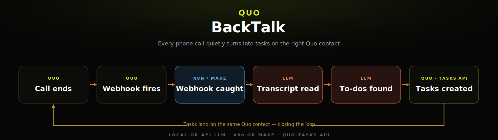

# BackTalk

**No code. No server. Your phone calls file their own follow-ups.**

Every call ends with a promise. BackTalk turns it into a Quo (formerly OpenPhone) task — set it up in your browser, no terminal required. Call ends → an AI reads the transcript → spoken commitments become native tasks linked to the call.

`License: MIT` · No-code paths for Zapier & Make · Self-host option for developers



---

## The follow-through gap

It's 4:50 on a Friday at Acme Plumbing. Alex Agent is wrapping up a call with Casey Caller: *"I'll send you the updated fee schedule tomorrow morning."* The line goes dead. The phone rings again. By Monday, that promise exists only in Casey's head — and Casey is the one who notices it was broken.

BackTalk closes that gap. The moment the call's transcript is ready, an AI reads the dialogue, and every explicit spoken commitment becomes a **native Quo Task attached to that call** — before Alex has even picked up the next one. From the example above: a task titled **"Send the updated fee schedule"**, due tomorrow morning, with Alex's exact words quoted in the description. Nobody typed anything.

By default it captures **your staff's** promises only — that's where follow-through breaks. Flip one setting and it also files what the caller promised ("I'll send the signed contract by Friday"), so you know when to nudge. It is bring-your-own-AI: OpenRouter, OpenAI, Anthropic, Groq — or fully local Ollama / LM Studio, so call transcripts can stay on your own hardware end to end.

> Quo's built-in AI action items require the Scale plan and only *suggest*. BackTalk works on any plan that has transcripts, and it *files* — real tasks, linked to the call, with due dates when one was spoken.

## Start in your no-code tool

Pick the platform you already use. Each one copies the BackTalk workflow into your account, then walks you through connecting your own accounts. **No `git`, no terminal, no server to run.**

### Zapier — "Use this Zap"

**One click to copy, then two connections.**

> **Use this Zap → `<<PASTE YOUR ZAP TEMPLATE LINK>>`**
>
> *(Until the maintainer publishes the shared template, this link points to the step-by-step build doc below — it is NOT a one-click button yet.)* In the meantime, follow [`docs/zapier.md`](docs/zapier.md) to build the four steps by hand.

What happens after you click:

1. **Copy** — the link opens a copy of the BackTalk Zap in **your** Zapier account, with the apps and events already chosen (Quo "Call transcript completed" → AI step → create a task).
2. **Connect your two accounts** — authorize your own Quo account (paste your Quo API key) and your AI provider. That is two connection screens, not one click.
3. **Re-enter the fields the template can't carry** — Zapier templates copy the *steps* but drop every *value* you'd typed in. So you re-paste the extraction prompt into the AI step and rebuild the task-creation step (it posts to the Quo Tasks API with your key in the `Authorization` header). [`docs/zapier.md`](docs/zapier.md) gives you the exact prompt text, URL, header, and JSON body to paste.

Honest note: because the task-creation leg uses a Webhooks/Custom Request step, a *fully* one-click public template isn't possible — the click copies the skeleton, and you finish the wiring with the values from the build doc. There is **no native "Create Quo task" Zapier action** to fall back on, which is why the task step is a webhook POST.

### Make — "Use this scenario"

**One click to copy, then two connections.**

> **Use this scenario → `<<PASTE YOUR MAKE SCENARIO LINK>>`**
>
> *(Until the maintainer publishes the shared scenario, this link points to the blueprint import below — see [Other ways to build it yourself](#other-ways-to-build-it-yourself). That is the slower path, not a one-click button.)*

What happens after you click:

1. **Copy** — anyone with the link can preview the scenario in their browser with no account. Logged in to Make, one click drops a copy into your account, fully wired (Watch new call transcripts → AI/HTTP step → HTTP POST to the Quo Tasks API).
2. **Connect your accounts** — Make never copies credentials. You authorize your Quo connection (generate a Quo API key in **Settings → API** and paste it) and re-select that connection inside the transcript trigger.
3. **Paste your keys into the HTTP steps** — your AI provider key for the analysis step, and your Quo API key as the raw `Authorization` header on the task-creation step. Then turn the scenario on (imported scenarios arrive switched off).

### One caveat before you start

Transcripts are the fuel, and they aren't free. BackTalk needs a paid **Quo Business or Scale plan with call recording turned on** — no transcripts, nothing to catch. Two more honest truths the "one click" doesn't cover: (1) you bring your own AI key, because the template can copy the steps but never your keys; and (2) the "Use this Zap" / "Use this scenario" buttons only become true one-click links once the maintainer publishes those shared templates — until then the links above point at the build docs, not a button that pretends to be one-click.

## What you'll need

- **A Quo (formerly OpenPhone) Business or Scale plan with call recording on** — that's what produces the transcripts BackTalk reads. Transcripts require Business or higher.
- **An AI provider key** — OpenRouter, OpenAI, Anthropic, or Groq work out of the box; or run it fully local with Ollama / LM Studio if you want transcripts to stay on your own hardware.
- **About 2 minutes to connect accounts** — copy the workflow, authorize Quo and your AI provider, paste your keys, turn it on.

## What this does NOT do

- Does **not** send SMS or messages of any kind.
- Does **not** modify or create contacts.
- Does **not** register webhooks or scenarios for you — you connect them in your no-code tool (or the Quo dashboard if you self-host). The tool never writes to your account except creating tasks.
- Does **not** store transcripts, recordings, or PII.
- Does **not** work without transcripts (plan requirement above).
- Does **not** do CRM sync, reminders, or completion tracking.
- Is **not** affiliated with or endorsed by Quo/OpenPhone.

## Security & privacy

**Your transcripts are never stored, and they only go to the AI provider you choose** (which can be your own machine via Ollama). The transcript is read once, in passing, to find the promises in it — then it's gone. The only thing BackTalk ever keeps, and only if you opt in, is a short list of call ids it has already processed (no names, no dialogue).

Under the hood, transcripts are treated as **hostile input**: anything a caller says is data, never instructions — a schema-locked prompt is backed by a deterministic validation layer (verbatim-quote groundedness check, enum whitelists, due-date sanity window, task caps, URL/email/phone scrubbing) that runs on every response, no exceptions. When you self-host, incoming webhooks are signature-verified by default (both Quo signing schemes, timing-safe, fail closed) with a replay window. Full threat model in [SECURITY.md](SECURITY.md).

---

## Advanced — self-host (for developers)

Everything below is for people who want to run BackTalk on their own infrastructure. **No-coders can stop reading — your path is the Zapier or Make section above.** Self-hosting gives you the full deterministic validation layer (a Node server) and keeps the entire pipeline on hardware you control.

> Every setting in the configuration table below is also available as a field inside your Zap or Make scenario — no-coders set values in those fields, not in a `.env` file.

### How it works (self-hosted)

Four stages, nothing else. Stateless pass-through: no transcript persisted, no PII stored.

```
              Quo (formerly OpenPhone)
                        |
                        |  webhook: call.transcript.completed
                        |  (payload carries the full dialogue — no polling)
                        v
        +-----------------------------------------+
        |                BackTalk                 |
        |                                         |
        |  1  receive + verify                    |
        |     HMAC signature, replay window,      |
        |     fail closed                         |
        |                  |                      |
        |  2  transcript acquire                  |
        |     inline from the webhook payload;    |
        |     guards: min duration, idempotency   |
        |                  |                      |
        |  3  AI promise extraction               |
        |     the endpoint YOU configure          |
        |     (OpenRouter / OpenAI / Anthropic /  |
        |      Groq / Ollama / LM Studio)         |
        |                  |                      |
        |  4  validate + create tasks             |
        |     deterministic checks, exfil scrub,  |
        |     then POST /v1/tasks (only write)    |
        +-----------------------------------------+
                        |
                        v
          Native Quo Task, linked to the call
          title · quote · spoken due date
```

The design is webhook-first: subscribe to `call.transcript.completed` and the event payload already contains the whole dialogue array, so the happy path makes **zero** read calls to the Quo API. (An optional `FALLBACK_POLL` mode exists for accounts that can only subscribe to `call.completed` — see [docs/architecture.md](docs/architecture.md).)

### Path 1 — Node (recommended: full validation layer)

Requires Node >= 20. There is nothing to install — zero dependencies.

```bash
git clone https://github.com/MisterSands/backtalk.git
cd backtalk
cp .env.example .env     # fill in QUO_API_KEY, QUO_WEBHOOK_SECRET, LLM_API_KEY, LLM_MODEL
node server.js           # listens on :8787
```

**Test locally first** — no account, no signature, no writes:

```bash
ALLOW_UNSIGNED=1 DRY_RUN=1 node server.js
# in another terminal:
curl -X POST localhost:8787/webhook \
  -H "content-type: application/json" \
  -d @fixtures/sample-webhook.json
```

You'll see the exact task payloads it *would* create, logged with a `[DRY_RUN]` prefix.

Then go live:

1. Expose the server over HTTPS (any tunnel or host works).
2. In the Quo dashboard, create a webhook pointing at `https://<your-host>/webhook`, subscribed to **`call.transcript.completed`** only.
3. Paste the signing key Quo shows you into `QUO_WEBHOOK_SECRET`, unset `ALLOW_UNSIGNED` and `DRY_RUN`, restart.

### Path 2 — Docker

```bash
docker build -t backtalk .
docker run --env-file .env -p 8787:8787 backtalk
```

Same env contract, same `/webhook` endpoint. `GET /healthz` is your liveness probe.

### Path 3 — Deploy to Render (browser-only, no terminal)

The repo ships a [`render.yaml`](render.yaml) blueprint, so you can stand the whole thing up from a browser — no terminal, but you're still hosting it yourself:

[](https://render.com/deploy?repo=https://github.com/MisterSands/backtalk)

1. **Click the button** (free Render account works). Render reads `render.yaml` and prompts you for the four required values: `QUO_API_KEY`, `QUO_WEBHOOK_SECRET`, `LLM_API_KEY`, `LLM_MODEL`.
   - Don't have the webhook secret yet? Enter a placeholder for `QUO_WEBHOOK_SECRET` — you'll get the real one in step 3.
2. **Deploy.** When it's live, copy your service URL: `https://<your-app>.onrender.com`.
3. **In the Quo dashboard** → webhooks → create a webhook pointing at `https://<your-app>.onrender.com/webhook`, subscribed to **`call.transcript.completed`** only. Quo shows you the signing key — copy it.
4. **Back in Render** → your service → Environment → set `QUO_WEBHOOK_SECRET` to that signing key. The service restarts automatically.
5. **Verify:** open `https://<your-app>.onrender.com/healthz` — you should see `{"ok":true}`. Make a test call; when the transcript completes, a task appears on the call's contact.

Caveats for the free tier: the instance spins down when idle, so the first webhook after a quiet period waits out a cold start (Quo retries deliveries, so nothing is lost — it's just slower). The in-memory dedupe also resets on every spin-down; the `ref:` marker check still prevents duplicate tasks.

### Other hosts

Any long-running Node 20+ host works. Two well-documented options:

- Render web services: <https://render.com/docs/web-services>
- Railway: <https://docs.railway.com/guides/express>

(Plain docs links — no tracking, no referrals.) Serverless platforms work for the webhook-first path with caveats (in-memory dedupe resets on cold start; `FALLBACK_POLL` and `IDEMPOTENCY_FILE` need a persistent process) — see [docs/architecture.md](docs/architecture.md).

### Configuration

Self-hosted, everything is configured via `.env` (see [`.env.example`](.env.example) for the commented version). No-coders set these same values as fields inside their Zap or Make scenario instead.

| Var | Required | Default | Meaning |
|---|---|---|---|
| `QUO_API_KEY` | yes | — | Quo API key. Sent raw (no Bearer prefix). |
| `QUO_WEBHOOK_SECRET` | yes* | — | Webhook signing secret(s), comma-separated to support one secret per registered webhook. Each entry is either a base64 `key` from webhook creation (current scheme) or a `whsec_...` value (beta scheme). *Optional only when `ALLOW_UNSIGNED=1`. |
| `LLM_PROVIDER` | no | `openai` | `openai` (OpenAI-compatible: OpenRouter, OpenAI, Groq, Ollama, LM Studio) or `anthropic` (native Messages API). |
| `LLM_BASE_URL` | no | `https://openrouter.ai/api/v1` | Base URL for the openai provider. Ollama example: `http://localhost:11434/v1`. Ignored by `anthropic`. |
| `LLM_API_KEY` | yes | — | Key for the chosen provider (any non-empty string for Ollama/LM Studio). |
| `LLM_MODEL` | yes | — | Model id, e.g. `anthropic/claude-haiku-4.5` (OpenRouter id). Any chat model that can follow a JSON schema works — check your provider's model list. |
| `LLM_FALLBACK_MODEL` | no | unset | Retried once if the primary returns empty/invalid JSON. Never taken from input. |
| `INCLUDE_CALLER_COMMITMENTS` | no | `0` | `1` → also file the caller's commitments (who=caller). |
| `MIN_CALL_SECONDS` | no | `30` | Calls shorter than this are skipped (voicemail/misdial guard) before any LLM spend. |
| `MAX_TASKS_PER_CALL` | no | `8` | Post-validation cap. Hard ceiling 8 — env may lower it, never raise it. |
| `MAX_TRANSCRIPT_CHARS` | no | `24000` | Head 60% + tail 40% cap with `[... middle trimmed ...]` marker (trim is model-input only; the full transcript is never stored). |
| `MIN_CONFIDENCE` | no | `medium` | Drop extracted commitments below this (`low`\|`medium`\|`high`). |
| `OWNED_NUMBERS` | no | unset | Fallback speaker map: `+15555550100=Alex Agent,+15555550101=Bailey Agent`. Matching identifiers are forced to AGENT. |
| `QUO_DEFAULT_ASSIGNEE` | no | unset | User id applied as `assignedTo` on every created task. |
| `TIMEZONE` | no | `UTC` | IANA tz passed into the prompt metadata for relative-date resolution ("tomorrow", "Tuesday"). |
| `PORT` | no | `8787` | Listen port. |
| `DEBUG` | no | `0` | `1` → verbose logs **including transcript text**. Default 0: transcripts are NEVER logged. |
| `DRY_RUN` | no | `0` | `1` → no POSTs to Quo; intended task payloads are logged instead. The only mode to use against a real account during development. |
| `IDEMPOTENCY_FILE` | no | unset | Optional JSON file persisting the call-id set across restarts (callId + status + timestamp ONLY — no PII). Unset = in-memory LRU only. |
| `IDEMPOTENCY_MAX` | no | `5000` | LRU capacity (call ids). |
| `SIGNATURE_SKEW_SECONDS` | no | `300` | Replay window: reject signatures older/newer than this. |
| `ALLOW_UNSIGNED` | no | `0` | `1` → skip signature verification (LOCAL DEV ONLY; the server logs a warning every request). |
| `FALLBACK_POLL` | no | `0` | `1` → on `call.completed`, retry-poll the transcript endpoint. Only for accounts that can't subscribe to `call.transcript.completed`. Requires a long-running host. |
| `REPLAY_TOKEN` | no | unset | If set, enables `POST /replay` (manual re-run) gated by the `x-replay-token` header (constant-time compare). |

### Self-hosted prerequisites & plan notes

- **Transcripts require a Quo Business or Scale plan.** No transcripts, no promises to catch.
- Subscribe the webhook to **`call.transcript.completed`** (preferred — payload carries the dialogue). `call.completed` carries metadata only.
- API key comes from your Quo workspace settings. Quirk worth knowing: the API expects the raw key in the `Authorization` header, **without** a `Bearer ` prefix.

### Other ways to build it yourself

If you'd rather assemble the workflow in a no-code tool from a versioned file (instead of the shared-link copy above), these are the do-it-yourself builds:

| Path | File | One-line caveat |
|---|---|---|
| n8n | `blueprints/n8n-backtalk.json` | Full validation layer in Code nodes; needs Raw Body on, and `crypto` allowed as a builtin. |
| Make (blueprint import) | `blueprints/make-backtalk.blueprint.json` | Download → scenario builder → ellipsis menu → Import Blueprint → choose the file. This is the more-steps path; the shared-scenario link above is the one-click Make route. You still add your own Quo connection and paste your API key afterward. |
| Zapier (step-by-step) | `docs/zapier.md` | Zaps aren't cleanly exportable, so this is a step-by-step build with sample payloads at every step — also the interim destination of the "Use this Zap" link until the template is published. |

## Beyond the hook

Built and maintained by **Business Coconut** — [www.MrSands.com](https://www.MrSands.com). The hosted version, vertical prompt packs (legal intake, contracting, real estate), and multi-system routing with daily did-it-actually-happen reconciliation are the kind of thing I build for clients — reach out at csands@gmail.com.

## License

[MIT](LICENSE) — © BackTalk contributors.
