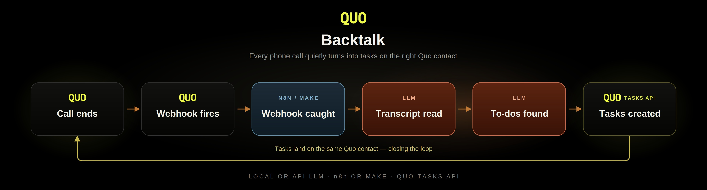

# BackTalk

**Every call ends with promises. BackTalk files them as Quo tasks before anyone forgets.**

A hang-up hook for Quo (formerly OpenPhone): call ends → your LLM reads the transcript → commitments become native tasks linked to the call.

`License: MIT` · `Node >= 20` · `Zero runtime dependencies` · `Zero dev dependencies`



---

## The follow-through gap

It's 4:50 on a Friday at Acme Plumbing. Alex Agent is wrapping up a call with Casey Caller: *"I'll send you the updated fee schedule tomorrow morning."* The line goes dead. The phone rings again. By Monday, that promise exists only in Casey's head — and Casey is the one who notices it was broken.

BackTalk closes that gap. The moment the call's transcript is ready, a webhook fires, your LLM reads the dialogue, and every explicit spoken commitment becomes a **native Quo Task attached to that call** — before Alex has even picked up the next one. From the example above: a task titled **"Send the updated fee schedule"**, due tomorrow morning, with Alex's exact words quoted in the description. Nobody typed anything.

By default it captures **your staff's** promises only — that's where follow-through breaks. Set `INCLUDE_CALLER_COMMITMENTS=1` and it also files what the caller promised ("I'll send the signed contract by Friday"), so you know when to nudge. It is bring-your-own-LLM: OpenRouter, OpenAI, Anthropic, Groq — or fully local Ollama / LM Studio, so call transcripts can stay on your own hardware end to end.

> Quo's built-in AI action items require the Scale plan and only *suggest*. This tool works on any plan that has transcripts, and it *files* — real tasks, linked to the call, with due dates when one was spoken.

## How it works

Four stages, nothing else. Stateless pass-through: no transcript persisted, no PII stored.

```
              Quo (formerly OpenPhone)
                        |
                        |  webhook: call.transcript.completed
                        |  (payload carries the full dialogue — no polling)
                        v
        +-----------------------------------------+
        |                BackTalk                 |
        |                                         |
        |  1  receive + verify                    |
        |     HMAC signature, replay window,      |
        |     fail closed                         |
        |                  |                      |
        |  2  transcript acquire                  |
        |     inline from the webhook payload;    |
        |     guards: min duration, idempotency   |
        |                  |                      |
        |  3  LLM promise extraction              |
        |     the endpoint YOU configure          |
        |     (OpenRouter / OpenAI / Anthropic /  |
        |      Groq / Ollama / LM Studio)         |
        |                  |                      |
        |  4  validate + create tasks             |
        |     deterministic checks, exfil scrub,  |
        |     then POST /v1/tasks (only write)    |
        +-----------------------------------------+
                        |
                        v
          Native Quo Task, linked to the call
          title · quote · spoken due date
```

The design is webhook-first: subscribe to `call.transcript.completed` and the event payload already contains the whole dialogue array, so the happy path makes **zero** read calls to the Quo API. (An optional `FALLBACK_POLL` mode exists for accounts that can only subscribe to `call.completed` — see [docs/architecture.md](docs/architecture.md).)

## 5-minute quickstart

### Path 1 — Node (recommended: full validation layer)

Requires Node >= 20. There is nothing to install — zero dependencies.

```bash
git clone https://github.com/MisterSands/backtalk.git
cd backtalk
cp .env.example .env     # fill in QUO_API_KEY, QUO_WEBHOOK_SECRET, LLM_API_KEY, LLM_MODEL
node server.js           # listens on :8787
```

**Test locally first** — no account, no signature, no writes:

```bash
ALLOW_UNSIGNED=1 DRY_RUN=1 node server.js
# in another terminal:
curl -X POST localhost:8787/webhook \
  -H "content-type: application/json" \
  -d @fixtures/sample-webhook.json
```

You'll see the exact task payloads it *would* create, logged with a `[DRY_RUN]` prefix.

Then go live:

1. Expose the server over HTTPS (any tunnel or host works).
2. In the Quo dashboard, create a webhook pointing at `https://<your-host>/webhook`, subscribed to **`call.transcript.completed`** only.
3. Paste the signing key Quo shows you into `QUO_WEBHOOK_SECRET`, unset `ALLOW_UNSIGNED` and `DRY_RUN`, restart.

### Path 2 — Docker

```bash
docker build -t backtalk .
docker run --env-file .env -p 8787:8787 backtalk
```

Same env contract, same `/webhook` endpoint. `GET /healthz` is your liveness probe.

### Path 3 — n8n

Import [`blueprints/n8n-backtalk.json`](blueprints/n8n-backtalk.json) — generic Webhook + Code + HTTP Request nodes only, no community-node dependency. Set the env vars listed in [`blueprints/README.md`](blueprints/README.md), enable **Raw Body** on the Webhook node, and point your Quo webhook at the n8n URL.

### Path 4 — Make

Import [`blueprints/make-backtalk.blueprint.json`](blueprints/make-backtalk.blueprint.json). It uses Make's native OpenPhone transcript trigger (the connection handles webhook registration for you) plus HTTP modules for the LLM and Tasks calls. Caveats in [`blueprints/README.md`](blueprints/README.md).

### Path 5 — Zapier

Zaps aren't cleanly exportable, so [`docs/zapier.md`](docs/zapier.md) is a step-by-step build with sample payloads at every step.

## Deploy

### Browser-only setup (no terminal required)

The repo ships a [`render.yaml`](render.yaml) blueprint, so you can stand the whole thing up from a browser:

[](https://render.com/deploy?repo=https://github.com/MisterSands/backtalk)

1. **Click the button** (free Render account works). Render reads `render.yaml` and prompts you for the four required values: `QUO_API_KEY`, `QUO_WEBHOOK_SECRET`, `LLM_API_KEY`, `LLM_MODEL`.
   - Don't have the webhook secret yet? Enter a placeholder for `QUO_WEBHOOK_SECRET` — you'll get the real one in step 3.
2. **Deploy.** When it's live, copy your service URL: `https://<your-app>.onrender.com`.
3. **In the Quo dashboard** → webhooks → create a webhook pointing at `https://<your-app>.onrender.com/webhook`, subscribed to **`call.transcript.completed`** only. Quo shows you the signing key — copy it.
4. **Back in Render** → your service → Environment → set `QUO_WEBHOOK_SECRET` to that signing key. The service restarts automatically.
5. **Verify:** open `https://<your-app>.onrender.com/healthz` — you should see `{"ok":true}`. Make a test call; when the transcript completes, a task appears on the call's contact.

Caveats for the free tier: the instance spins down when idle, so the first webhook after a quiet period waits out a cold start (Quo retries deliveries, so nothing is lost — it's just slower). The in-memory dedupe also resets on every spin-down; the `ref:` marker check still prevents duplicate tasks.

### Other hosts

Any long-running Node 20+ host works. Two well-documented options:

- Render web services: <https://render.com/docs/web-services>
- Railway: <https://docs.railway.com/guides/express>

(Plain docs links — no tracking, no referrals.) Serverless platforms work for the webhook-first path with caveats (in-memory dedupe resets on cold start; `FALLBACK_POLL` and `IDEMPOTENCY_FILE` need a persistent process) — see [docs/architecture.md](docs/architecture.md).

## Configuration

Everything is configured via `.env` (see [`.env.example`](.env.example) for the commented version):

| Var | Required | Default | Meaning |
|---|---|---|---|
| `QUO_API_KEY` | yes | — | Quo API key. Sent raw (no Bearer prefix). |
| `QUO_WEBHOOK_SECRET` | yes* | — | Webhook signing secret(s), comma-separated to support one secret per registered webhook. Each entry is either a base64 `key` from webhook creation (current scheme) or a `whsec_...` value (beta scheme). *Optional only when `ALLOW_UNSIGNED=1`. |
| `LLM_PROVIDER` | no | `openai` | `openai` (OpenAI-compatible: OpenRouter, OpenAI, Groq, Ollama, LM Studio) or `anthropic` (native Messages API). |
| `LLM_BASE_URL` | no | `https://openrouter.ai/api/v1` | Base URL for the openai provider. Ollama example: `http://localhost:11434/v1`. Ignored by `anthropic`. |
| `LLM_API_KEY` | yes | — | Key for the chosen provider (any non-empty string for Ollama/LM Studio). |
| `LLM_MODEL` | yes | — | Model id, e.g. `anthropic/claude-haiku-4.5` (OpenRouter id). Any chat model that can follow a JSON schema works — check your provider's model list. |
| `LLM_FALLBACK_MODEL` | no | unset | Retried once if the primary returns empty/invalid JSON. Never taken from input. |
| `INCLUDE_CALLER_COMMITMENTS` | no | `0` | `1` → also file the caller's commitments (who=caller). |
| `MIN_CALL_SECONDS` | no | `30` | Calls shorter than this are skipped (voicemail/misdial guard) before any LLM spend. |
| `MAX_TASKS_PER_CALL` | no | `8` | Post-validation cap. Hard ceiling 8 — env may lower it, never raise it. |
| `MAX_TRANSCRIPT_CHARS` | no | `24000` | Head 60% + tail 40% cap with `[... middle trimmed ...]` marker (trim is model-input only; the full transcript is never stored). |
| `MIN_CONFIDENCE` | no | `medium` | Drop extracted commitments below this (`low`\|`medium`\|`high`). |
| `OWNED_NUMBERS` | no | unset | Fallback speaker map: `+15555550100=Alex Agent,+15555550101=Bailey Agent`. Matching identifiers are forced to AGENT. |
| `QUO_DEFAULT_ASSIGNEE` | no | unset | `US...` user id applied as `assignedTo` on every created task. |
| `TIMEZONE` | no | `UTC` | IANA tz passed into the prompt metadata for relative-date resolution ("tomorrow", "Tuesday"). |
| `PORT` | no | `8787` | Listen port. |
| `DEBUG` | no | `0` | `1` → verbose logs **including transcript text**. Default 0: transcripts are NEVER logged. |
| `DRY_RUN` | no | `0` | `1` → no POSTs to Quo; intended task payloads are logged instead. The only mode to use against a real account during development. |
| `IDEMPOTENCY_FILE` | no | unset | Optional JSON file persisting the call-id set across restarts (callId + status + timestamp ONLY — no PII). Unset = in-memory LRU only. |
| `IDEMPOTENCY_MAX` | no | `5000` | LRU capacity (call ids). |
| `SIGNATURE_SKEW_SECONDS` | no | `300` | Replay window: reject signatures older/newer than this. |
| `ALLOW_UNSIGNED` | no | `0` | `1` → skip signature verification (LOCAL DEV ONLY; the server logs a warning every request). |
| `FALLBACK_POLL` | no | `0` | `1` → on `call.completed`, retry-poll the transcript endpoint. Only for accounts that can't subscribe to `call.transcript.completed`. Requires a long-running host. |
| `REPLAY_TOKEN` | no | unset | If set, enables `POST /replay` (manual re-run) gated by the `x-replay-token` header (constant-time compare). |

## Prerequisites & plan notes

- **Transcripts require a Quo Business or Scale plan.** No transcripts, no promises to catch.
- Subscribe the webhook to **`call.transcript.completed`** (preferred — payload carries the dialogue). `call.completed` carries metadata only.
- API key comes from your Quo workspace settings. Quirk worth knowing: the API expects the raw key in the `Authorization` header, **without** a `Bearer ` prefix.

## Security & privacy

Signatures are verified by default (both Quo signing schemes, timing-safe, fail closed) with a replay window. Transcripts are treated as **hostile input**: anything a caller says is data, never instructions — a schema-locked prompt is backed by a deterministic validation layer (verbatim-quote groundedness check, enum whitelists, due-date sanity window, task caps, URL/email/phone scrubbing) that runs on every response, no exceptions.

**Privacy:** transcripts are processed in-memory, sent only to the LLM endpoint *you* configure (which can be your own machine via Ollama), and stored nowhere. The only persisted state, if you opt into it, is a list of processed call ids. Full threat model in [SECURITY.md](SECURITY.md).

## Blueprints

| Path | File | One-line caveat |
|---|---|---|
| n8n | `blueprints/n8n-backtalk.json` | Full validation layer in Code nodes; needs Raw Body on, and `crypto` allowed as a builtin. |
| Make | `blueprints/make-backtalk.blueprint.json` | Native trigger handles webhook auth, but the validation layer is weaker than the Node server's — see blueprints/README.md. |
| Zapier | `docs/zapier.md` | Step-by-step build doc (zaps aren't exportable). |

## What this does NOT do

- Does **not** send SMS or messages of any kind.
- Does **not** modify or create contacts.
- Does **not** register webhooks for you — you create them in the Quo dashboard. The tool never writes to your account except `POST /v1/tasks`.
- Does **not** store transcripts, recordings, or PII.
- Does **not** work without transcripts (plan requirement above).
- Does **not** do CRM sync, reminders, or completion tracking.
- Is **not** affiliated with or endorsed by Quo/OpenPhone.

## Beyond the hook

Built and maintained by **Business Coconut** — [www.MrSands.com](https://www.MrSands.com). The hosted version, vertical prompt packs (legal intake, contracting, real estate), and multi-system routing with daily did-it-actually-happen reconciliation are the kind of thing I build for clients — reach out at csands@gmail.com.

## License

[MIT](LICENSE) — © BackTalk contributors.
